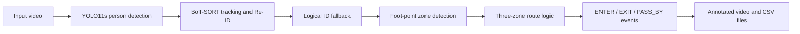

# People Counting with YOLO11s and BoT-SORT

A video analytics prototype for counting movement events around a doorway. The
system detects people, tracks their identities across frames, and uses a
three-zone route to classify each movement as:

- `ENTER` - a person enters the room
- `EXIT` - a person exits the room
- `PASS_BY` - a person walks past the doorway without entering

The project is designed for fixed-camera video and produces an annotated video,
an event table, and debug data for tuning the counting logic.

## How It Works



### 1. Person Detection

The notebook uses `yolo11s.pt` to detect only the `person` class in each video
frame. Instead of using the center of the bounding box, the system uses its
bottom-center point as the person's approximate foot position:

```python
foot_point = (
    int((x1 + x2) / 2),
    int(y2),
)
```

This makes the zone classification more meaningful because each polygon
represents an area on the floor.

### 2. Tracking and Two-Layer Re-ID

The system uses two identity layers to reduce duplicate counts when a person is
temporarily occluded or receives a new tracker ID:

1. **BoT-SORT tracker** maintains a `track_id` across frames. The enhanced
   notebook variant enables appearance-based Re-ID with `yolo11n-cls.pt`.
2. **Logical ID fallback** maps a new `track_id` back to an existing
   `logical_id` when it appears near the person's most recent location within a
   limited time window.

The second layer is a lightweight time-and-distance heuristic. It improves
robustness, but it can still merge identities incorrectly when several people
walk very close to each other.

### 3. Three-Zone Counting Logic

The doorway is divided into three polygons:

| Zone | Meaning |
| --- | --- |
| `outside` | Walkway or area in front of the room |
| `door` | Doorway transition area |
| `inside` | Area inside the room |

The route history determines the event:

| Event | Typical route |
| --- | --- |
| `ENTER` | `outside -> door -> inside` |
| `EXIT` | `inside -> door -> outside` or a confirmed `door -> outside` transition |
| `PASS_BY` | Movement remains outside without entering the door area |

To reduce boundary jitter, a zone change is accepted only after the foot point
stays in the new zone for several consecutive frames.

## Notebook Variants

| Notebook | Purpose |
| --- | --- |
| `people_counting_3zone.ipynb` | Basic three-zone `ENTER` and `EXIT` prototype |
| `people_counting_3zone_passing_fixed.ipynb` | Three-zone counting with improved `PASS_BY` handling |
| `people_counting_room_sideflow_colab.ipynb` | Extended Colab version with Re-ID config and left/right route details |

For the standard doorway-counting workflow, start with
`people_counting_3zone_passing_fixed.ipynb`.

## Installation

Python 3.10 or newer is recommended.

```bash
python -m pip install -r requirements.txt
```

The project can run on CPU, but a GPU is strongly recommended for faster video
processing.

## Running the Notebook

Start Jupyter:

```bash
jupyter notebook
```

Open one of the notebooks and run the cells in order.

Update `VDO_PATH` before processing the video. Example for Google Colab:

```python
VDO_PATH = r"/content/entrance.mov"
```

Example for Windows:

```python
VDO_PATH = r"E:\Download_D\entrance.mov"
```

Some notebook variants include a `gdown` cell for downloading the sample video
from Google Drive. Skip that cell when using a local video file.

## Outputs

The three-zone notebook creates:

| File | Description |
| --- | --- |
| `outputs/entrance_3zone_result.mp4` | Annotated video with zones, bounding boxes, IDs, routes, and counters |
| `events.csv` | Event-level data such as frame, timestamp, event type, route, and logical ID |
| `debug.csv` | Logical-ID debug table for reviewing missed or incorrect counts |

`Total` is the number of events, not the number of unique people. The same
person may produce both an `ENTER` and an `EXIT` event.

## Reference Result

One reference run on the sample doorway video produced:

| Event | Count |
| --- | ---: |
| `ENTER` | 13 |
| `EXIT` | 41 |
| `PASS_BY` | 19 |
| **Total events** | **73** |

These values are a sample result, not a fixed expected output. Changing the
video, polygons, model version, or thresholds may change the counts.

## Main Parameters to Tune

| Parameter | Purpose |
| --- | --- |
| `INSIDE_ZONE`, `DOOR_ZONE`, `OUTSIDE_ZONE` | Polygon coordinates for the camera view |
| `CONF_THRES` | Minimum YOLO confidence score |
| `MIN_STABLE_FRAMES` | Frames required before accepting a zone transition |
| `MAX_REID_GAP` | Maximum time gap for restoring an existing logical ID |
| `MAX_REID_DIST` | Maximum distance for logical-ID restoration |
| `ENTER_CONFIRM_FRAMES` | Fallback confirmation for an entry hidden by occlusion |
| `MIN_PASS_MOVE_DIST` | Minimum outside movement distance before counting `PASS_BY` |

The sample polygons were designed for a `1920x1080` video. They must be
redefined when the camera position, angle, or resolution changes.

## Known Limitations

- Camera movement can shift the polygons relative to the scene.
- Occlusion and crowded areas can cause tracker ID switches.
- A person visible inside the room may be detected even when the desired focus
  is the doorway.
- The logical-ID fallback is heuristic and requires threshold tuning.
- Results should be validated on multiple videos before production use.

## Project Structure

```text
.
|-- people_counting_3zone.ipynb
|-- people_counting_3zone_passing_fixed.ipynb
|-- people_counting_room_sideflow_colab.ipynb
|-- requirements.txt
|-- yolo11s.pt
|-- debug_frames/
|-- docs/
`-- outputs/
```

## Future Improvements

- Stabilize the input video or dynamically adjust zones for camera movement.
- Evaluate tracker thresholds on crowded scenes.
- Add a small labeled validation set and report event-level precision and
  recall.
- Convert the notebook workflow into a configurable command-line application.
